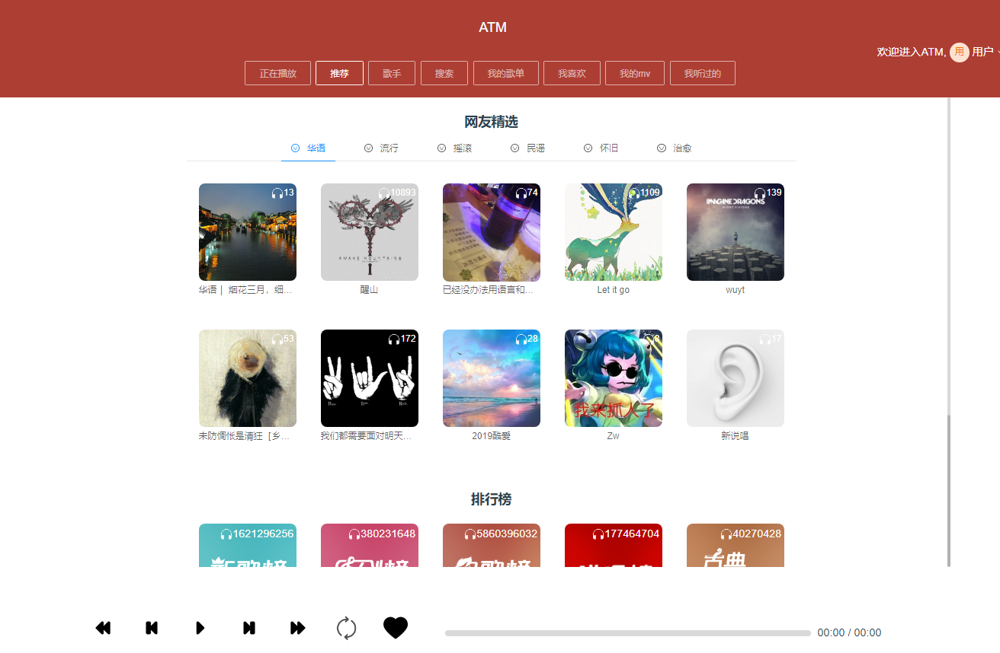

# ATM态度音乐

## 界面


## 环境
  node
  mongodb

## 启动
```
  启动前端服务
  cd attitudemusic
  npm i
  npm run serve

  启动后端服务
  cd attitudeBackground
  npm i
  nodemon app.js

  启动资源服务
  cd NeteaseCloudMusicApi-master
  npm i
  nodemon app.js
```
## 作者
  github: [edison](https://github.com/genaller)

## 免责声明
  本站音频文件来自各网站接口，本站不会修改任何音频文件

  音频版权来自各网站，本站只提供数据查询服务，不提供任何音频存储和贩卖服务

  本项目仅为前端练手项目，请勿用作商业用途，请勿通过本项目下载盗版歌曲资源，否则后果自负！
